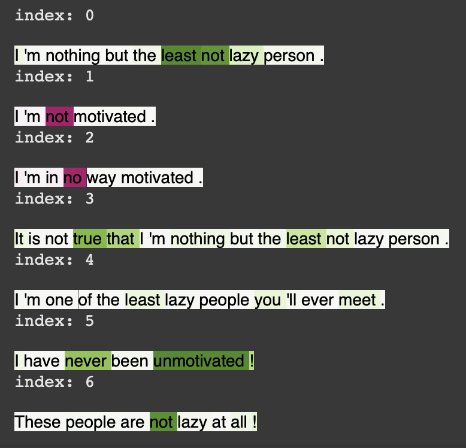
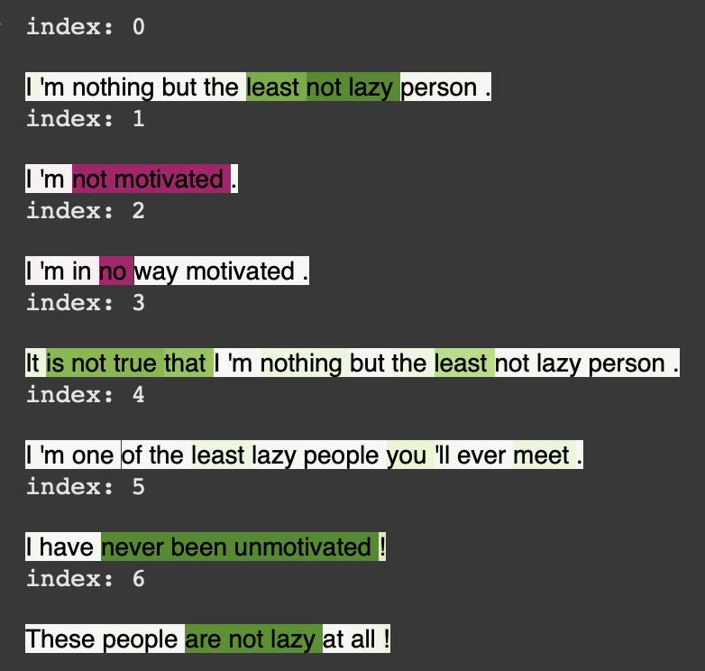

# Agency IG

This repository is created for the purpose of the paper "Application of Integrated Gradients Explainability to Sociopsychological Semantic Markers." In order to have more readable results before rendinering tokens attributions calcuated by Integrated gradients method graphicaly , some preprocessing steps are necessary as follow:

## RoBERTa to SpaCy mapping
The RoBERTa tokenizer often splits words into multiple tokens (e.g., X), where darker highlights indicate stronger association values. For example, the word "unmotivated" is split into three tokens. To address this, we used the `_spacy_map` function in the code to align RoBERTa tokens with [SpaCy](https://spacy.io), a popular Python NLP tool that provides a more interpretable token structure. Using offset information, the attributions of split tokens are summed to produce unified values, resulting in SpaCy-style associations (e.g., Y).


## Group Negations
Negations often carry most of the association meaning, although conceptually, the association should also be linked to the word being negated. For example, in the negative agency sentence:

**These people are not lazy at all! (13)**

the word “not” carries most of the association value. However, in practice, we want the pair “not lazy” to convey the positive agentic meaning. To address this, we use [SpaCy](https://spacy.io) to identify such pairs and provide a more interpretable result where the two words are linked and assigned the sum of their agency values.

The underlying rationale is to associate a negation with the word or verb it refers to. In the case of an auxiliary verb, we also include the adjectival complement (acomp, e.g., “not be lazy”) or the passive auxiliary (auxpass, e.g., “never been unmotivated”) to fully capture the meaning. Additionally, phrasal verb particles (prt, e.g., “shut down”) are included in the analysis. `_group_negations` function in the code was used for this purpose.

## Resolving Inconsistent Association Signs
Some of the associations might have a sign that is not coherent with the overall agency value. For example, in a sentence that carries a positive agency overall, the words “person” and “lazy” might carry negative association values, which could be confusing. To address this, in the visual representation of agency at the word level, we set to zero all association values that are inconsistent with the overall agency.

## Normalizing the attributions
Finally, to facilitate the interpretation of the results, the maximum association value is normalized to the actual agency value **F(x)**. This ensures that lower agency levels are represented by weaker colors. For example:

**Join our next #fridays4future strike! (17)**

is displayed in a weaker green color compared to (16) because it carries a lower agency level.

the last two processes are done in the function `_map_ag`.


## Grouped Negations and Visualization

Here’s how the visualization looks:

### Without Grouping Negations


### With Grouping Negations


This demonstrates the difference between token attributions with and without grouping negations.


---

## Installments

To use the package, the following libraries are required:

```python
import pandas as pd
import numpy as np
from tqdm.auto import tqdm
import re
!pip install ftfy --quiet
import ftfy
import torch
from torch.utils.data import TensorDataset, DataLoader
from transformers import AutoTokenizer, AutoModelForSequenceClassification
!pip install captum --quiet
from captum.attr import IntegratedGradients
import spacy
from IPython.display import HTML
import matplotlib as mpl
import matplotlib.cm
```

---

## Example Usage

### Define Your Sentences
```python
sentences = [
    "I'm nothing but the least not lazy person.",
    "I'm not motivated.",
    "I'm in no way motivated.",
    "It is not true that I'm nothing but the least not lazy person.",
    "I'm one of the least lazy people you'll ever meet.",
    'I have never been unmotivated!',
    'These people are not lazy at all!'
]
```

### Instantiate and Extract Integrated Gradients
```python
# Instantiate an element for IG inspection
ba0 = AgencyIG()

# Extract IG attributions
ba0.extract_ig(sentences)

# Show the result
for i in range(len(sentences)):
    ba0.render_ig(i)
```

### Get the LaTeX Code
```python
# Show the LaTeX result
for i in range(len(sentences)):
    ba0.latex_render_ig(i)
```

---

## How It Works

Integrated Gradients (IG) is a method for attributing the output of a model to its input features by integrating gradients along a path from a baseline input to the actual input.

For a model \( f \) and input \( x \), the IG of input feature \( i \) is defined as:

$$
\text{IG}_i(x) = (x_i - x_i^0) \times \int_{\alpha=0}^1 \frac{\partial f(x^0 + \alpha \cdot (x - x^0))}{\partial x_i} d\alpha
$$

Where \( x^0 \) is the baseline input.

---

## File Structure

```
/agency-ig/
├── README.md          # Documentation
├── LICENSE            # License file
├── requirements.txt   # Dependencies
├── agency_ig.py       # Main code file
└── examples/
    └── example_usage.py  # Example script
```

---

## License

This project is licensed under the [MIT License](LICENSE).

---

## Citation

If you use this code in your research, please cite it as:

```
@misc{agency-ig,
  author = {Your Name},
  title = {Agency IG: Integrated Gradients for NLP Tasks},
  year = {2025},
  howpublished = {\url{https://github.com/yourusername/agency-ig}}
}
```

---

## Contact

For any questions or issues, feel free to open an issue on GitHub or contact [your_email@example.com](mailto:your_email@example.com).
