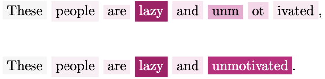
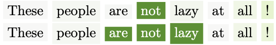
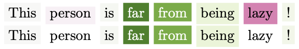
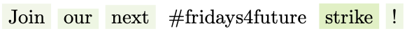

# Agency IG

## Repository Overview

This repository was created for the paper *"Application of Integrated Gradients Explainability to Sociopsychological Semantic Markers."* 

To produce more readable results before rendering token attributions calculated by the Integrated Gradients method, some preprocessing steps are necessary, as follows:

## Preprocessing the tokens and attributions

### RoBERTa to SpaCy mapping
The RoBERTa tokenizer often splits words into multiple tokens, as shown in the example below, where darker highlights indicate stronger association values. For example, the word "unmotivated" is split into three tokens. To address this, we used the `_spacy_map` function in the code to align RoBERTa tokens with [SpaCy](https://spacy.io),that provides a more interpretable token structure. Using offset information, the attributions of split tokens are summed to produce unified values, resulting in SpaCy-style associations.



### Grouping Negations
Negations often carry most of the association meaning, although conceptually, the association should also be linked to the word being negated. For example, in the negative agency sentence below the word “not” carries most of the association value. However, in practice, we want the pair “not lazy” to convey the positive agentic meaning. To address this, we use SpaCy to identify such pairs and provide a more interpretable result where the two words are linked and assigned the sum of their agency values.



The underlying rationale is to associate a negation with the word or verb it refers to. In the case of an auxiliary verb, we also include the adjectival complement (acomp, e.g., “not be lazy”) or the passive auxiliary (auxpass, e.g., “never been unmotivated”) to fully capture the meaning. Additionally, phrasal verb particles (prt, e.g., “shut down”) are included in the analysis. `_group_negations` function in the code was used for this purpose.

### Resolving Inconsistent Association Signs
Some of the associations might have a sign that is not coherent with the overall agency value. For example, in the sentence below that carries a positive agency overall, the words “person” and “lazy” might carry negative association values, which could be confusing. To address this, in the visual representation of agency at the word level, we set to zero all association values that are inconsistent with the overall agency.



### Normalizing the attributions
Finally, to facilitate the interpretation of the results, the maximum association value is normalized to the actual agency value **F(x)**. This ensures that lower agency levels are represented by weaker colors. For example:



is displayed in a weaker green color compared to the previous example, because it carries a lower agency level.

**The last two processes are performed in the function `_map_ag`.**

## Installation

To set up the environment and install the required libraries, follow these steps:

### Step 1: Clone the Repository
```bash
git clone https://github.com/ali-abbi/agency-ig.git
cd agency-ig
```
### Step 2: Open the Jupyter Notebook
Launch the notebook from your terminal:

```bash
jupyter notebook agency_ig.ipynb
```
### Step 3: Install Dependencies from Within the Notebook
At the beginning of the notebook, there’s a code cell that installs the required dependencies by running:

```python
!pip install -r installments.txt --quiet
```
Also you will see this code cell to install SpaCy's language model:

```python
import spacy
!python -m spacy download en_core_web_sm --quiet
```

## Example Usage

### Define Your Sentences
```python
sentences = [
    "I'm nothing but the least not lazy person.",
    "I'm not motivated.",
    "I'm in no way motivated.",
    "It is not true that I'm nothing but the least not lazy person.",
    "I'm one of the least lazy people you'll ever meet.",
    'I have never been unmotivated!',
    'These people are not lazy at all!'
]
```

### Instantiate and Extract Integrated Gradients
```python
# Instantiate an element for IG inspection
ai = AgencyIG()

# Extract IG attributions
ai.extract_ig(sentences)

# Show the result
for i in range(len(sentences)):
    ai.render_ig(i)
```

### Get the LaTeX Code
```python
# Show the LaTeX result
for i in range(len(sentences)):
    ba0.render_ig(i,latex=True)
```

---

## File Structure

```
/agency-ig/
├── README.md          # Documentation
├── LICENSE            # License file
├── requirements.txt   # Dependencies
├── agency_ig.py       # Main code file
└── examples/
    └── example_usage.py  # Example script
```

---

## License

This project is licensed under the [MIT License](LICENSE).

---

## Citation

If you use this code in your research, please cite it as:

```
@misc{agency-ig,
  author = {Your Name},
  title = {Agency IG: Integrated Gradients for NLP Tasks},
  year = {2025},
  howpublished = {\url{https://github.com/yourusername/agency-ig}}
}
```

---

## Contact

For any questions or issues, feel free to open an issue on GitHub or contact [your_email@example.com](mailto:your_email@example.com).
